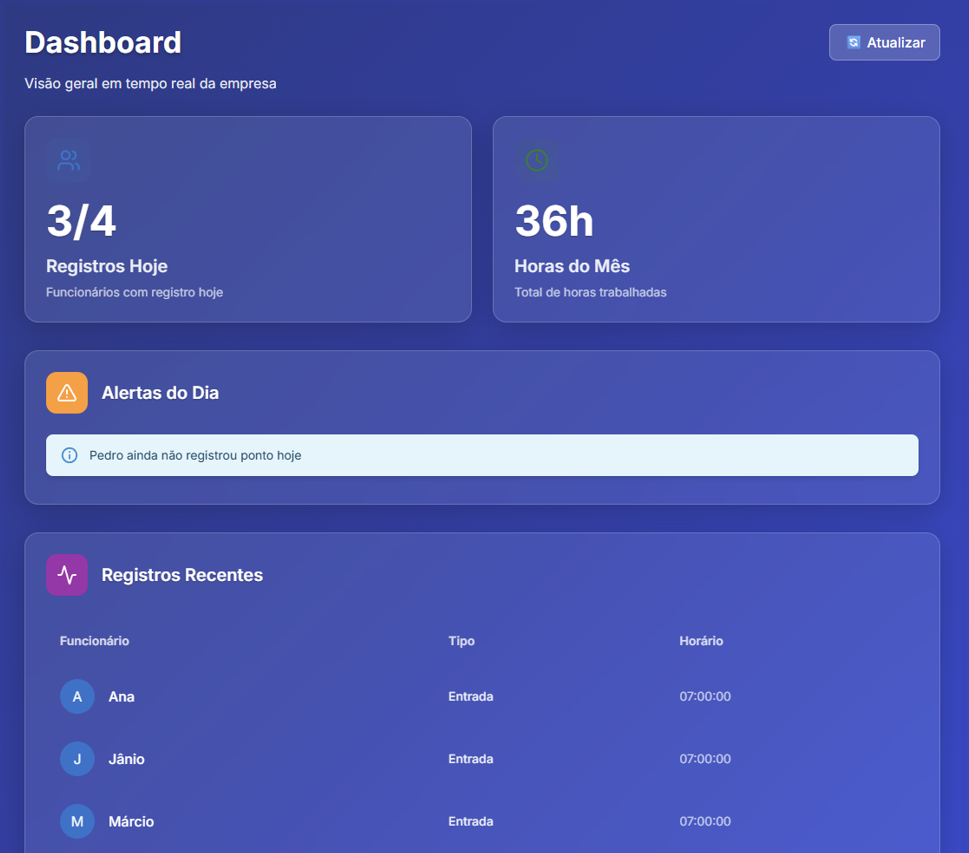
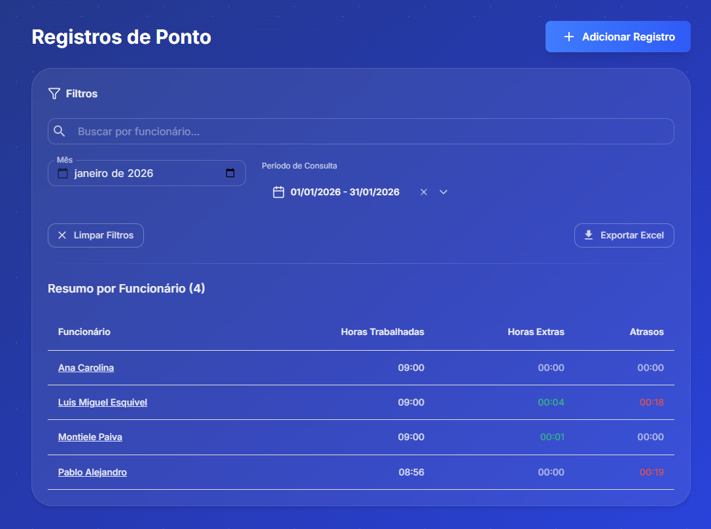
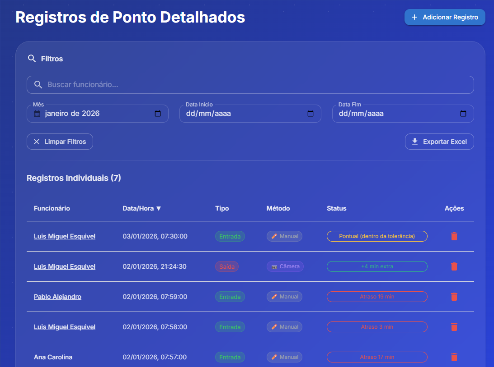
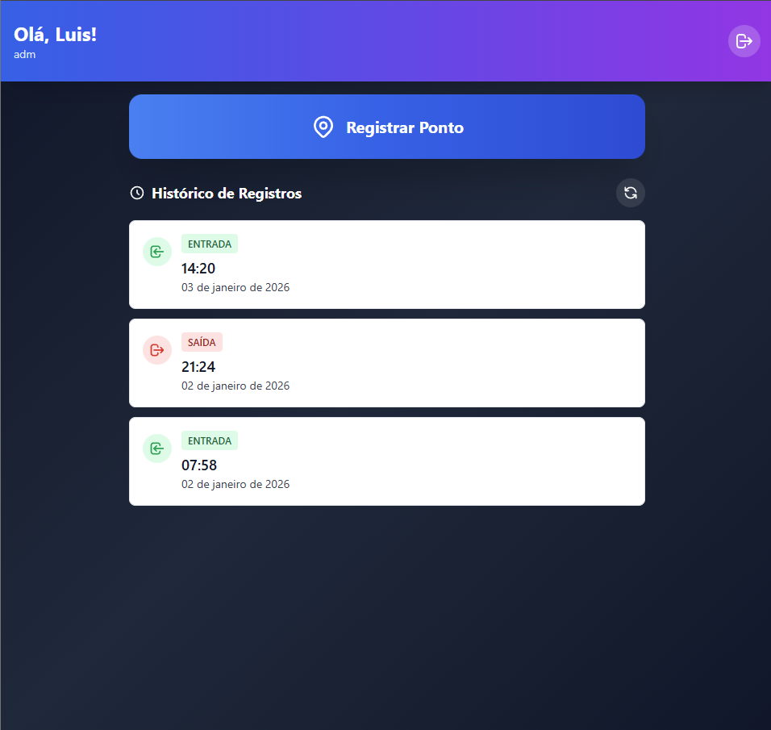
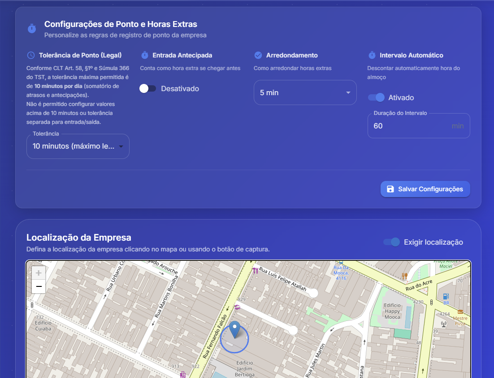
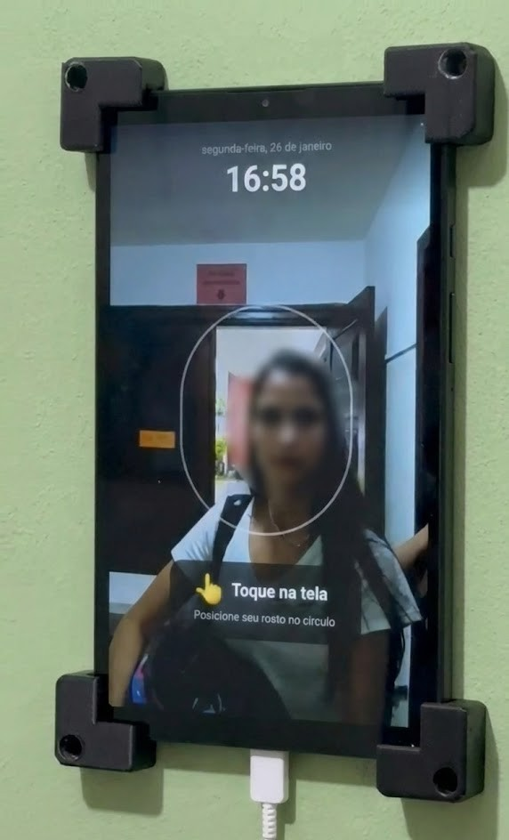

# RegistraPonto - Sistema de Controle de Ponto Eletrônico

Plataforma completa de controle de ponto com reconhecimento facial e geolocalização. O projeto integra backend em Python/Flask, web app React e PWA mobile, com foco em segurança, precisão de registros e experiência fluida para equipes e administradores.

## Estrutura do repositório

```
RP_Full/
├── backend/          # API REST (Flask, Python)
├── front/            # Dashboard web (React, TypeScript, Vite)
├── admin-portal/    # Painel administrativo (React, TypeScript)
├── pwa-mobile/      # PWA para registro de ponto (React, Vite)
├── mobile/          # App mobile (React Native / Expo)
├── landingpage/     # Landing page do produto
└── docs/            # Documentação de configuração e manutenção
```

Cada pasta é um projeto independente (com seu próprio `package.json` ou `requirements.txt`). Para rodar, entre na pasta desejada e siga o README local.

## Como rodar (resumo)

1. **Backend** (obrigatório para as apps): `cd backend` → criar `.env` a partir de `env.example` → `pip install -r requirements.txt` → `python app.py`
2. **Front (dashboard)**: `cd front` → `.env` com `VITE_API_URL` → `npm install` → `npm run dev`
3. **Admin Portal**: `cd admin-portal` → `.env` com `VITE_API_URL` → `npm install` → `npm run dev`
4. **PWA Mobile**: `cd pwa-mobile` → `.env` com `VITE_API_URL` → `npm install` → `npm run dev`

## Visão geral

O RegistraPonto permite o registro de ponto por múltiplas interfaces (web e PWA), centralizando operações administrativas em um painel único. A solução utiliza AWS Rekognition para reconhecimento facial e DynamoDB/S3 para armazenamento escalável.

## 🖼️ Preview do Sistema

### Dashboard


### Registros


### Registros detalhados


### Funcionario


### Configurações


### Captura (tablet em uso real)


## Módulos do projeto

| Pasta           | Descrição                    | Stack principal                    |
|-----------------|-----------------------------|------------------------------------|
| `backend/`      | API REST                    | Flask, Python, DynamoDB, S3, Rekognition |
| `front/`        | Dashboard (empresa/funcionários) | React, TypeScript, Vite, MUI       |
| `admin-portal/` | Painel administrativo       | React, TypeScript, Vite, Tailwind   |
| `pwa-mobile/`   | Registro de ponto (PWA)     | React, Vite, PWA, geolocalização   |
| `mobile/`       | App mobile                  | React Native / Expo                |
| `landingpage/`  | Site institucional          | React, Tailwind                    |

## Tecnologias

- **Backend**: Flask, JWT, boto3, AWS Rekognition, DynamoDB, S3.
- **Frontend**: React 18, TypeScript, Vite, Material UI, TailwindCSS.
- **Infra**: AWS (DynamoDB, S3, Rekognition); deploy em EC2/Nginx.
- **Mobile**: PWA instalável com suporte offline.

## Funcionalidades principais

- Reconhecimento facial e validação por geolocalização.
- Painel administrativo com relatórios e indicadores.
- CRUD de funcionários com upload de fotos.
- Registros de ponto com filtros e exportação.
- Isolamento de dados por empresa e controle de permissões.

## Destaques de arquitetura

- Separação por módulos (API, web, portal, PWA).
- Backend organizado em `routes/`, `services/`, `utils/`, `config/`.
- Autenticação JWT e autorização por perfis.
- Variáveis sensíveis em `.env` (não commitadas).

---

*Projeto de portfólio*