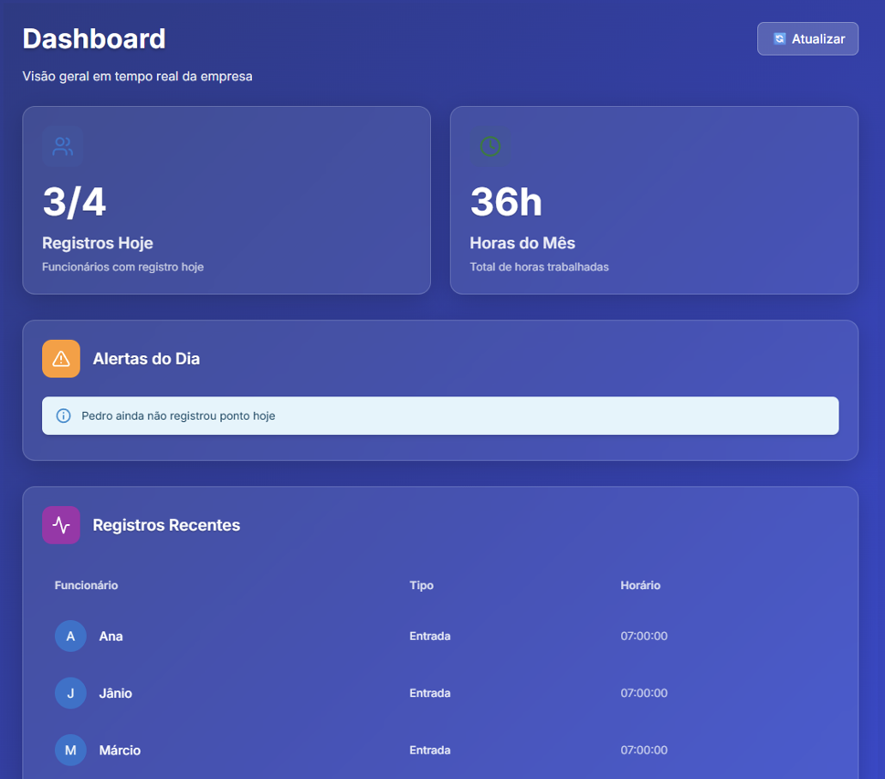
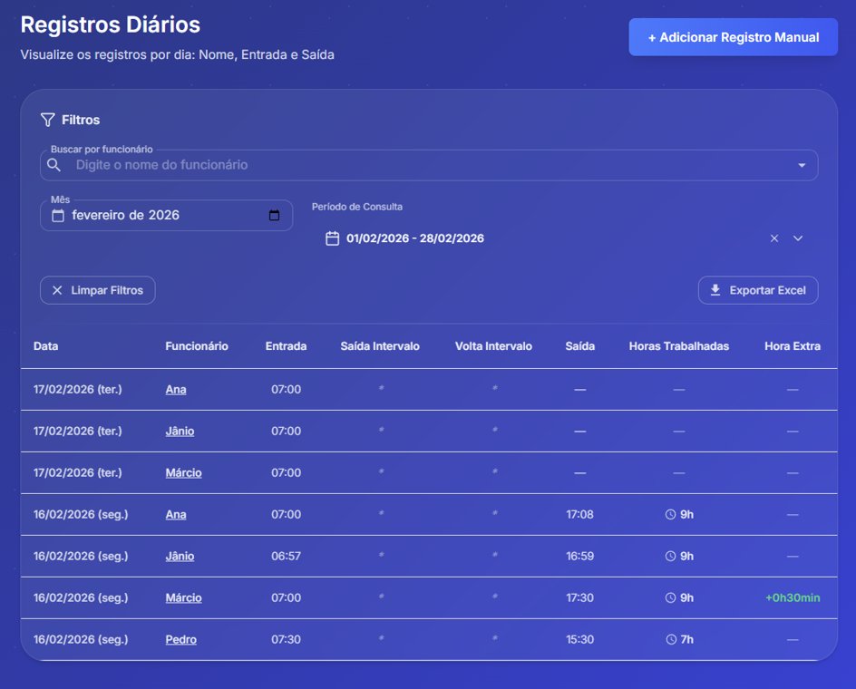
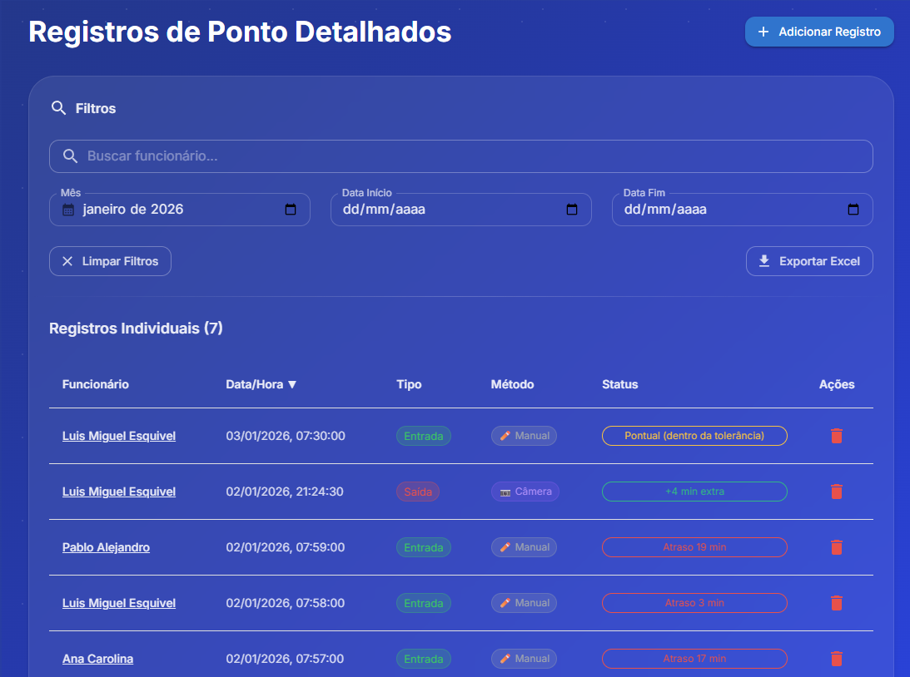
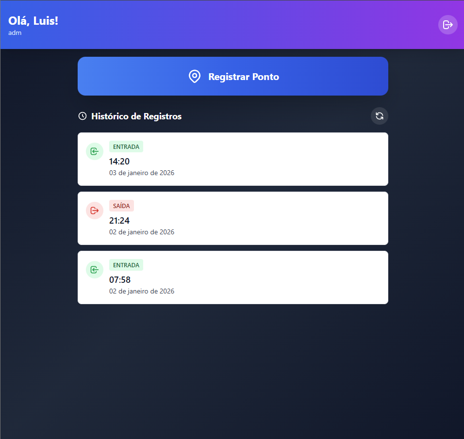
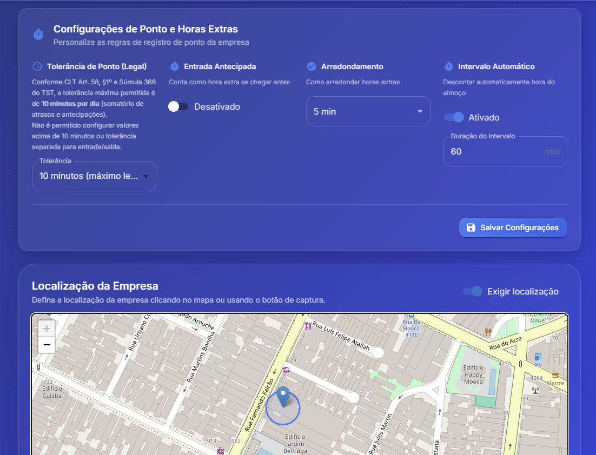
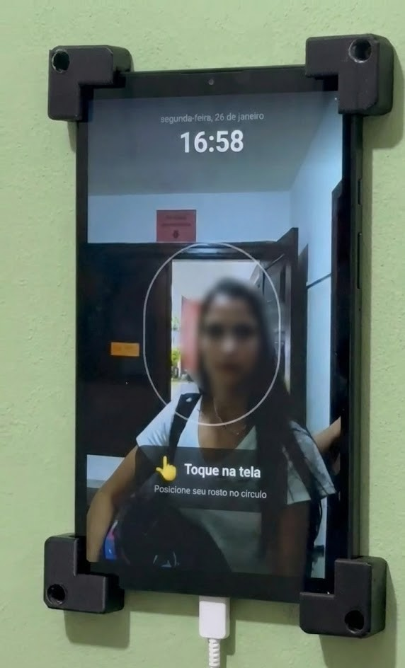

# RegistraPonto - Sistema de Controle de Ponto Eletrônico

Sistema completo de controle de ponto eletrônico com reconhecimento facial e geolocalização, desenvolvido para empresas de diversos portes.

## 🚀 Visão Geral

O RegistraPonto é uma plataforma integrada que permite o registro de ponto de funcionários através de múltiplas interfaces: web, PWA mobile e portal administrativo. Utiliza tecnologias avançadas como reconhecimento facial via AWS Rekognition e geolocalização para garantir precisão e segurança nos registros.

A solução centraliza operações administrativas em um painel único, com foco em segurança, precisão de registros e experiência fluida para equipes e administradores.

## 🖼️ Preview do Sistema

### Dashboard


Painel principal com indicadores de presença, estatísticas e visão geral dos registros.

### Gestão de Registros


Visualização completa de todos os registros de ponto com filtros avançados.

### Registros Detalhados


Informações detalhadas de cada registro incluindo foto, localização e horários.

### Gestão de Funcionários


CRUD completo de funcionários com upload de fotos para reconhecimento facial.

### Configurações


Configurações da empresa, horários de trabalho e parâmetros do sistema.

### Sistema em Uso Real


Dispositivo tablet configurado em modo kiosk para registro de ponto com reconhecimento facial.

## 🏗️ Arquitetura e Organização do Projeto

O projeto é dividido em módulos independentes, cada um responsável por uma parte específica do sistema:

```
RP_Full/
├── backend/                    # API REST em Flask + Python
│   ├── app.py                 # Servidor principal
│   ├── requirements.txt       # Dependências Python
│   ├── testar_sistema.py      # Suite de testes
│   └── .env                   # Configurações AWS e JWT
│
├── front/                      # Frontend Web (React + TypeScript)
│   ├── src/
│   │   ├── components/        # Componentes reutilizáveis
│   │   ├── pages/            # Páginas da aplicação
│   │   ├── services/         # Integrações com API
│   │   └── App.tsx           # Componente raiz
│   ├── package.json
│   └── vite.config.ts
│
├── admin-portal/              # Portal Administrativo
│   ├── src/
│   │   ├── components/
│   │   ├── pages/
│   │   └── App.tsx
│   └── package.json
│
├── pwa-mobile/                # Progressive Web App
│   ├── src/
│   │   ├── components/
│   │   ├── pages/
│   │   └── App.tsx
│   ├── public/
│   │   └── manifest.json     # Configuração PWA
│   └── vite.config.ts
│
└── landingpage/               # Landing page do projeto
    └── image/                 # Screenshots do sistema
```

### Backend (Flask + Python)
- **Localização**: `backend/`
- **Tecnologias**: Flask, AWS Rekognition, DynamoDB, S3, JWT, boto3
- **Responsabilidades**:
  - API RESTful para todas as operações
  - Integração com AWS para reconhecimento facial
  - Gerenciamento de dados e autenticação
  - Cálculos de horas extras e relatórios
  - Validação de permissões e isolamento por empresa

### Frontend Web (React)
- **Localização**: `front/`
- **Tecnologias**: React 18, TypeScript, Vite, Material UI, TailwindCSS
- **Funcionalidades**:
  - Dashboard administrativo com indicadores
  - Gestão completa de funcionários
  - Visualização e filtros de registros
  - Relatórios e estatísticas
  - Exportação de dados

### Portal Administrativo (React)
- **Localização**: `admin-portal/`
- **Tecnologias**: React, TypeScript, Vite
- **Propósito**: Interface dedicada para administradores do sistema com funcionalidades avançadas

### PWA Mobile (Progressive Web App)
- **Localização**: `pwa-mobile/`
- **Tecnologias**: React, Vite, Tailwind CSS, PWA APIs
- **Funcionalidades**:
  - Registro de ponto via geolocalização
  - Modo kiosk para reconhecimento facial
  - Funciona offline com sincronização
  - Instalável como app nativo
  - Interface otimizada para dispositivos móveis

## 🔧 Tecnologias e Serviços

### Backend
- **Flask** - Framework web Python
- **JWT** - Autenticação segura
- **boto3** - SDK AWS para Python
- **AWS Rekognition** - Reconhecimento facial
- **DynamoDB** - Banco de dados NoSQL
- **S3** - Armazenamento de fotos

### Frontend
- **React 18** - Biblioteca UI
- **TypeScript** - Tipagem estática
- **Vite** - Build tool e dev server
- **Material UI** - Componentes prontos
- **TailwindCSS** - Framework CSS utility-first

### Infraestrutura AWS
- **Lambda** - Funções serverless
- **API Gateway** - Exposição da API
- **S3 + CloudFront** - Hospedagem e CDN
- **Route 53** - Gerenciamento DNS
- **Certificate Manager** - SSL/TLS

## ✨ Funcionalidades Principais

### ✅ Implementadas
- **Autenticação JWT** - Login seguro para empresas e funcionários
- **Reconhecimento Facial** - Integração com AWS Rekognition para validação de identidade
- **Geolocalização** - Registro de ponto baseado em localização com validação de raio
- **Dashboard Completo** - Visualização de estatísticas, indicadores e relatórios em tempo real
- **Gestão de Funcionários** - CRUD completo com upload de fotos e validação
- **Registros de Ponto** - Listagem, filtros avançados e exportação para CSV
- **Multi-empresa** - Isolamento completo de dados por empresa
- **PWA** - Experiência mobile nativa com instalação e modo offline
- **Modo Kiosk** - Interface dedicada para tablets em pontos de registro
- **Controle de Permissões** - Diferentes níveis de acesso (admin, gerente, funcionário)

### 🚧 Em Desenvolvimento
- Exportação avançada (PDF com formatação personalizada)
- Notificações push para alertas de registro
- Modo escuro para todas as interfaces
- Relatórios mensais detalhados com gráficos
- Integração com folha de pagamento

## 📋 Pré-requisitos

- **Python 3.8+** (para backend)
- **Node.js 18+** e npm (para frontends)
- **AWS Account** com acesso a:
  - AWS Rekognition
  - Amazon S3
  - Amazon DynamoDB
- **Git** para controle de versão

## 🔧 Instalação e Configuração

### 1. Clonagem do Repositório
```bash
git clone <url-do-repositorio>
cd RP_Full
```

### 2. Configuração do Backend
```bash
cd backend

# Instalar dependências
pip install -r requirements.txt

# Configurar variáveis de ambiente
cp .env.example .env
# Edite o arquivo .env com suas credenciais AWS

# Executar servidor de desenvolvimento
python app.py
```

O backend estará disponível em `http://localhost:5000`

### 3. Configuração do Frontend Web
```bash
cd front

# Instalar dependências
npm install

# Configurar variáveis de ambiente
cp .env.example .env
# Edite o arquivo .env se necessário

# Executar em desenvolvimento
npm run dev
```

Acesse em `http://localhost:5173`

### 4. Configuração do Portal Administrativo
```bash
cd admin-portal

# Instalar dependências
npm install

# Executar em desenvolvimento
npm run dev
```

Acesse em `http://localhost:5174`

### 5. Configuração do PWA Mobile
```bash
cd pwa-mobile

# Instalar dependências
npm install

# Executar em desenvolvimento
npm run dev
```

Acesse em `http://localhost:5175`

## 🌐 Configurações de Ambiente

### Backend (.env)
```env
# AWS Credentials
AWS_ACCESS_KEY_ID=your_access_key_here
AWS_SECRET_ACCESS_KEY=your_secret_key_here
AWS_REGION=us-east-1

# AWS Services
DYNAMODB_TABLE=registraponto-table
S3_BUCKET=registraponto-bucket
REKOGNITION_COLLECTION=registraponto-faces

# Security
JWT_SECRET=your_super_secret_jwt_key_here
JWT_EXPIRATION=86400

# Flask
FLASK_ENV=development
FLASK_DEBUG=True
```

### Frontend (.env)
```env
# API Configuration
VITE_API_URL=http://localhost:5000

# App Configuration
VITE_APP_NAME=REGISTRA.PONTO
VITE_APP_VERSION=1.0.0

# Features
VITE_ENABLE_FACIAL_RECOGNITION=true
VITE_ENABLE_GEOLOCATION=true
```

## 🔒 Segurança

- **Autenticação JWT** com tokens de expiração automática
- **HTTPS obrigatório** para funcionalidades de câmera e geolocalização em produção
- **Isolamento de dados** por empresa com chaves compostas no DynamoDB
- **Validação de permissões** em todas as rotas protegidas
- **Armazenamento seguro** de tokens no localStorage com criptografia
- **Sanitização de inputs** para prevenção de SQL/NoSQL injection
- **CORS configurado** para aceitar apenas origens confiáveis
- **Rate limiting** nas rotas de API sensíveis

## 📊 Banco de Dados

### DynamoDB
Tabela principal com estrutura otimizada para queries:
- **Partition Key**: `empresa_id`
- **Sort Key**: `tipo#id` (funcionario#001, registro#20240101120000)
- **Índices secundários**: GSI para queries por CPF, data, status

### S3
Organização de buckets:
- Política de acesso com presigned URLs
- Versionamento habilitado para auditoria

## 🚀 Deploy

### Backend (AWS Lambda + API Gateway)
```bash
cd backend

# Instalar dependências de produção
pip install -r requirements.txt -t ./package

# Criar pacote de deploy
cd package
zip -r ../deployment.zip .
cd ..
zip -g deployment.zip app.py

# Deploy via AWS CLI ou Console
```

### Frontend (S3 + CloudFront)
```bash
cd front

# Build de produção
npm run build

# Deploy para S3
aws s3 sync dist/ s3://

# Invalidar cache do CloudFront
aws cloudfront create-invalidation --distribution-id YOUR_DIST_ID --paths "/*"
```

### Infraestrutura como Código
Considere usar AWS CloudFormation ou Terraform para provisionamento automatizado de recursos.

## 📝 Scripts Disponíveis

### Backend
```bash
python app.py              # Executar servidor de desenvolvimento
python testar_sistema.py   # Executar suite de testes
```

### Frontend/Portal/PWA
```bash
npm run dev        # Servidor de desenvolvimento com hot reload
npm run build      # Build otimizado para produção
npm run preview    # Preview local do build de produção
npm run lint       # Verificar código com ESLint
npm run type-check # Verificar tipagem TypeScript
```

## 📱 Uso do Sistema

### Para Administradores
1. Acesse o portal web e faça login com credenciais de empresa
2. Cadastre funcionários no módulo "Funcionários"
3. Configure horários de trabalho em "Configurações"
4. Monitore registros em tempo real no Dashboard
5. Gere relatórios e exporte dados conforme necessário

### Para Funcionários
1. Acesse o PWA mobile ou utilize tablet em modo kiosk
2. Posicione-se em frente à câmera para reconhecimento facial
3. Confirme registro quando localização estiver dentro do raio permitido
4. Visualize histórico de registros no app

## 🎯 Destaques de Arquitetura

- **Separação de Responsabilidades**: Módulos independentes com APIs bem definidas
- **Escalabilidade**: Uso de serviços gerenciados AWS para crescimento horizontal
- **Resiliência**: Fallbacks e tratamento de erros em todas as camadas
- **Performance**: Lazy loading, code splitting e otimização de assets
- **Manutenibilidade**: TypeScript, linting e padrões de código consistentes
- **Segurança**: Múltiplas camadas de validação e autenticação

## 🤝 Contribuição

Contribuições são bem-vindas! Para contribuir:

1. Faça um Fork do projeto
2. Crie uma branch para sua feature (`git checkout -b feature/nova-feature`)
3. Commit suas mudanças (`git commit -m 'feat: adiciona nova feature'`)
4. Push para a branch (`git push origin feature/nova-feature`)
5. Abra um Pull Request

### Padrões de Commit
Utilize [Conventional Commits](https://www.conventionalcommits.org/):
- `feat:` - Nova funcionalidade
- `fix:` - Correção de bug
- `docs:` - Documentação
- `style:` - Formatação
- `refactor:` - Refatoração de código
- `test:` - Testes
- `chore:` - Manutenção

## 📄 Licença

Este projeto está sob a licença MIT. Veja o arquivo `LICENSE` para mais detalhes.

## 👨‍💻 Suporte e Contato

Para dúvidas, problemas ou sugestões:

1. Consulte a documentação específica de cada módulo
2. Verifique os logs de erro no console
3. Abra uma issue no repositório
4. Entre em contato: [https://www.linkedin.com/in/lmiguelesqui/]

## 🎓 Projeto de Portfólio

Este projeto foi desenvolvido como demonstração de habilidades em:
- Desenvolvimento full-stack com Python e React
- Integração com serviços AWS
- Arquitetura de sistemas escaláveis
- Implementação de PWAs
- Segurança e autenticação
- UI/UX moderno e responsivo

---

**Desenvolvido para controle de ponto eletrônico moderno e seguro**  
📍 Versão 1.0.0  
🔧 Stack: Python • React • TypeScript • AWS  
📅 Última atualização: Fevereiro 2025
